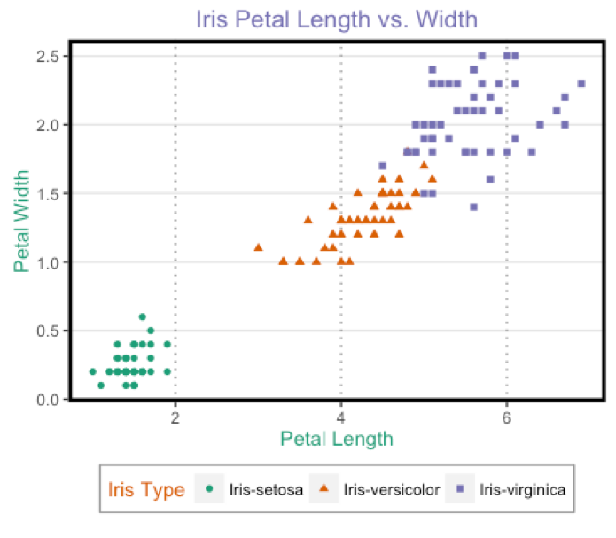

```{r setup, include=FALSE}

knitr::opts_chunk$set(echo = TRUE, warning = FALSE, message = FALSE)
#Package management (you don't need to do anything with this, it just makes sure you have all the #packages you need for this assignment):

# check if pacman is install, if not, install it from cran and load

if (!require("pacman")) {
      install.packages("pacman", dependencies=TRUE, repos='http://cran.rstudio.com/')
      library(pacman)
}

# packages used in this report:
pacman::p_load("tidyverse", "unvotes", "countrycode", "lubridate", "forcats", "nycflights13")


#You'll need this function later
make_datetime_100 <- function(year, month, day, time) {
  make_datetime(year, month, day, time %/% 100, time %% 100)
}

```

```{css, echo=FALSE}
.ans {
   background-color:rgb(248,248,248); 
  padding: 1em; 
  border: .1em solid #CCC;
  border-radius:.2em;
  color:purple;
  margin: 1em 0;
}
```
**Make sure your solution to each question includes enough output to show that your solution is correct (i.e if asked to create a vector, output the vector afterwards)**


## Question 1 - Graph Customization [7 marks]
<center>

</center>

Use the `iris` dataset from the `datasets` package. Produce a scatterplot of petal length vs petal width using ggplot2. Modify the resulting graph so that it matches the above.

- Color codes: '#1b9e77','#d95f02','#7570b3'
- Major x axis lines: grey90
- Major y axis lines: grey60
- No minor axis lines

```{r}
Color_codes <- c('#1b9e77','#d95f02','#7570b3')
iris %>% 
  ggplot(aes(Petal.Length, Petal.Width, color = Species, shape = Species)) + 
  geom_point() + 
  # Title renamed
labs(title = "Iris Petal Length vs.Width") +
  # x-label renamed
xlab("Petal Length") +
  # y-label renamed
ylab("Petal Width") +
  # Legend texts renamed (Specify both color and shape)
scale_shape_discrete(
  name = "Iris Type", 
  breaks=c("setosa", "versicolor", "virginica"), 
  labels = c("Iris-setosa", "Iris-versicolor", "Iris-virginica")) +
scale_color_manual(
  name = "Iris Type", values = Color_codes, 
  breaks=c("setosa", "versicolor", "virginica"), 
  labels = c("Iris-setosa", "Iris-versicolor", "Iris-virginica")) +
  # Title Specification
theme(plot.title = element_text(hjust = 0.5, size = 14, color = '#7570b3'), 
  # Axis x Specification
  axis.title.x = element_text(colour = '#1b9e77'), 
  # Axis y Specification
  axis.title.y = element_text(colour = '#1b9e77'), 
  # Legend Specification
  legend.position="bottom", 
  legend.background=element_rect(color="grey60"), 
  legend.title = element_text(colour="#d95f02"), 
  # Panel Specification
  panel.background = element_rect(fill = "white"), 
  panel.grid.major.x = element_line(colour = "grey60", linetype = "dotted"), 
  panel.grid.major.y=element_line(colour = "grey90"), 
  panel.grid.minor = element_blank(), 
  panel.border = element_rect(fill=NA, size = 2, color = "black"), 
  # change dimension of the plot
  plot.margin = margin(0, 2.1, 0, 2.1, "cm")) 

``` 

## Question 2 -Dplyr [8 marks]
 
Use the `mtcars` dataset and the tools in the **dplyr** library to complete the following tasks:

a. Return rows of cars that have an `mpg` value greater than 20 and 6 cylinders. [1 mark]
```{r}
mtcars %>% 
  filter(mpg > 20, cyl == 6)
``` 
b. Reorder the Data Frame by `cyl` first, then by descending `wt`. [1 mark]
```{r}
mtcars %>% 
  arrange(cyl, desc(wt))
``` 
c. Return a dataframe which contains just the `mpg` and `hp` columns. [1 mark]
```{r}
mtcars %>% 
  select(mpg,hp)
``` 
d. Return the distinct values of the `gear` column. [1 mark]
```{r}
mtcars %>% 
  distinct(gear)
``` 
e. Create a new column called "Performance" which is calculated by `hp` divided by `wt`. [1 mark]
```{r}
mtcars %>% 
  mutate(Performance = hp/wt)
``` 
f. Find the overall mean mpg. [1 mark]
```{r}
mtcars %>% 
  summarise(Average_mpg = mean(mpg))
``` 
g. Use pipe operators to get the mean hp value for cars with 6 cylinders. [2 marks]
```{r}
mtcars %>% 
  filter(cyl == 6) %>% 
  summarise(mean(hp))
``` 


## Question 3 - Joining [10 marks]

Use **dplyr** and mutating/filter joins to briefly answer the following questions (your answers should include inline RMarkdown where relevent).  You will need to use the `nycflights13` data set examined in class.

a. Create a dataframe which extends the flights dataframe with location of the origin and destination (i.e. the lat and lon). [2 marks]
```{r}
flights %>% 
  # Extend with origin location
  left_join(select(airports, origin = faa, origin_lat = lat, origin_lon = lon), 
             by = "origin") %>% 
  # Extend with destination location
  left_join(select(airports, dest = faa, dest_lat = lat, dest_lon = lon), 
             by = "dest")
``` 

b. Is there a relationship between the age of a plane and its delays? [2 marks]
```{r}
planes %>% 
  # Select tailnum column and create age column 
  transmute(tailnum, age = 2021-year) %>% 
  # Join with flights data by tailnum column
  inner_join(select(flights, tailnum, dep_delay), by = "tailnum") %>% 
  # Group data by tailnum and age
  group_by(tailnum, age) %>% 
  # Remove the NA observations for age and dep_delay columns
  filter(!is.na(age),!is.na(dep_delay)) %>% 
  # Calculate the average dep_delay per tailnumber and age
  summarise(Mean_dep_delay = mean(dep_delay)) %>% 
  # Draw the relationship b/w age and delay time considering for each tailnumber
  ggplot(aes(age, Mean_dep_delay)) + 
  geom_point() + 
  xlab ("Age of a plane") + 
  ylab("Average delay time") + 
  labs(title = "Relationship b/w the average delay time and age of a plane for each specific tailnumber") + 
  theme(plot.title = element_text(hjust = 0.5, size = 11))

planes %>% 
  # Select tailnum column and create age column 
  transmute(tailnum, age = 2021-year) %>% 
  # Join with flights data by tailnum column
  inner_join(select(flights, tailnum, dep_delay), by = "tailnum") %>% 
  # Group data only by age
  group_by(age) %>% 
  # Remove the NA observations for age and dep_delay columns
  filter(!is.na(age),!is.na(dep_delay)) %>% 
  # Calculate the average dep_delay for an each age
  summarise(Mean_dep_delay = mean(dep_delay)) %>% 
  # Draw the relationship b/w age and delay time
  ggplot(aes(age, Mean_dep_delay)) + 
  geom_point() + 
  xlab ("Age of a plane") + 
  ylab("Average delay time") + 
  labs(title = "Relationship b/w the average delay time and age of a plane") + 
  theme(plot.title = element_text(hjust = 0.5, size = 11))

``` 
<div class="ans">
The first plot shows the relationship between the average delay time and the age of a plane for each specific tail number. As we can see, we cannot conclude any clear relationship between these two features. Thus, I generated the second plot by not considering the tail number. Therefore, I grouped them by age to see any relationship between plane age and delay time. As it is clear, again, there is no relationship between these two.
</div>

c. What weather conditions make it more likely to see a delay? [2 marks]
```{r}
TempVsDelay <- weather %>% 
  # Join the weather data frame with flights data to see the dep_delay
  inner_join(select(flights, year, month, day, hour, origin, dep_delay), 
             by = c("year", "month", "day", "hour", "origin")) %>% 
  # Remove NA observations for dep_delay and temp column
  filter(!is.na(dep_delay), !is.na(temp)) %>% 
  # Group them by temp
  group_by(temp) %>% 
  # Calculate the number and average of the dep_delay for each temperature
  summarise(count= n(), Ave_delay = mean(dep_delay))

  # Plot the data to see any relationship b/w temperature and delay time
  TempVsDelay %>% 
    ggplot(aes(temp, Ave_delay, color = count)) + 
    geom_point() + 
    xlab ("Temprature") + 
    ylab("Average delay time") + 
    labs(title = "Relationship b/w the average delay time and temprature") + 
    theme(plot.title = element_text(hjust = 0.5, size = 11))

# Specify the boundaries for high occurrence
Temp <- TempVsDelay %>% 
  filter (count > 4000) %>% 
  arrange(temp)

# I did the same for other weather conditions to see the relationship b/w delay time and the weather conditions.

DewpVsDelay <- weather %>% 
  inner_join(select(flights, year, month, day, hour, origin, dep_delay), 
             by = c("year", "month", "day", "hour", "origin")) %>% 
  filter(!is.na(dep_delay), !is.na(dewp)) %>% 
  group_by(dewp) %>% 
  summarise(count= n(), Ave_delay = mean(dep_delay))

  DewpVsDelay %>% 
    ggplot(aes(dewp, Ave_delay, color = count)) + 
    geom_point() + 
    xlab ("Dew point") + 
    ylab("Average delay time") + 
    labs(title = "Relationship b/w the average delay time and dew point") + 
    theme(plot.title = element_text(hjust = 0.5, size = 11))

Dewp <- DewpVsDelay %>% 
  filter (count > 4000) %>% 
  arrange(dewp)

HumidVsDelay <- weather %>% 
  inner_join(select(flights, year, month, day, hour, origin, dep_delay), 
             by = c("year", "month", "day", "hour", "origin")) %>% 
  filter(!is.na(dep_delay), !is.na(humid)) %>% 
  group_by(humid) %>% 
  summarise(count= n(), Ave_delay = mean(dep_delay))

  HumidVsDelay %>% 
    ggplot(aes(humid, Ave_delay, size = count)) + 
    geom_point() + 
    xlab ("Humidity") + 
    ylab("Average delay time") + 
    labs(title = "Relationship b/w the average delay time and humidity") + 
    theme(plot.title = element_text(hjust = 0.5, size = 11))

Humid <- HumidVsDelay %>% 
  filter (count > 2000) %>% 
  arrange(humid)

Wind_dirVsDelay <- weather %>% 
  inner_join(select(flights, year, month, day, hour, origin, dep_delay), 
             by = c("year", "month", "day", "hour", "origin")) %>% 
  filter(!is.na(dep_delay), !is.na(wind_dir)) %>% 
  group_by(wind_dir) %>% 
  summarise(count= n(), Ave_delay = mean(dep_delay))

  Wind_dirVsDelay %>% 
    ggplot(aes(wind_dir, Ave_delay, size = count)) + 
    geom_point() + 
    xlab ("Wind direction") + 
    ylab("Average delay time") + 
    labs(title = "Relationship b/w the average delay time and wind direction") + 
    theme(plot.title = element_text(hjust = 0.5, size = 11))

Wind_dir <- Wind_dirVsDelay %>% 
  filter (Ave_delay > 15, count > 5000) %>% 
  arrange(wind_dir)

Wind_speedVsDelay <- weather %>% 
  inner_join(select(flights, year, month, day, hour, origin, dep_delay), 
             by = c("year", "month", "day", "hour", "origin")) %>% 
  filter(!is.na(dep_delay), !is.na(wind_speed)) %>% 
  group_by(wind_speed) %>% 
  summarise(count= n(), Ave_delay = mean(dep_delay))

  Wind_speedVsDelay %>% 
    ggplot(aes(wind_speed, Ave_delay, size = count)) + 
    geom_point() + 
    xlab ("Wind speed") + 
    ylab("Average delay time") + 
    labs(title = "Relationship b/w the average delay time and wind speed") + 
    theme(plot.title = element_text(hjust = 0.5, size = 11))

Wind_speed <- Wind_speedVsDelay %>% 
  filter (count > 5000) %>% 
  arrange(wind_speed)


Wind_gustVsDelay <- weather %>% 
  inner_join(select(flights, year, month, day, hour, origin, dep_delay), 
             by = c("year", "month", "day", "hour", "origin")) %>% 
  filter(!is.na(dep_delay), !is.na(wind_gust)) %>% 
  group_by(wind_gust) %>% 
  summarise(count= n(), Ave_delay = mean(dep_delay))

  Wind_gustVsDelay %>% 
    ggplot(aes(wind_gust, Ave_delay, size = count)) + 
    geom_point() + 
    xlab ("Wind gust") + 
    ylab("Average delay time") + 
    labs(title = "Relationship b/w the average delay time and wind gust") + 
    theme(plot.title = element_text(hjust = 0.5, size = 11))

PrecipVsDelay <- weather %>% 
  inner_join(select(flights, year, month, day, hour, origin, dep_delay), 
             by = c("year", "month", "day", "hour", "origin")) %>% 
  filter(!is.na(dep_delay), !is.na(precip)) %>% 
  group_by(precip) %>% 
  summarise(count= n(), Ave_delay = mean(dep_delay))

  PrecipVsDelay %>% 
    ggplot(aes(precip, Ave_delay, size = count)) + 
    geom_point() + 
    xlab ("Precipitation") + 
    ylab("Average delay time") + 
    labs(title = "Relationship b/w the average delay time and precipitation") + 
    theme(plot.title = element_text(hjust = 0.5, size = 11))

 

PressureVsDelay <- weather %>% 
  inner_join(select(flights, year, month, day, hour, origin, dep_delay), 
             by = c("year", "month", "day", "hour", "origin")) %>% 
  filter(!is.na(dep_delay), !is.na(pressure)) %>% 
  group_by(pressure) %>% 
  summarise(count= n(), Ave_delay = mean(dep_delay))

  PressureVsDelay %>% 
    ggplot(aes(pressure, Ave_delay, color = count)) + 
    geom_point() + 
    xlab ("Pressure") + 
    ylab("Average delay time") + 
    labs(title = "Relationship b/w the average delay time and pressure") + 
    theme(plot.title = element_text(hjust = 0.5, size = 11))

Pressure <- PressureVsDelay %>% 
  filter (count > 1500) %>% 
  arrange(pressure)

VisibVsDelay  <- weather %>% 
  inner_join(select(flights, year, month, day, hour, origin, dep_delay), 
             by = c("year", "month", "day", "hour", "origin")) %>% 
  filter(!is.na(dep_delay), !is.na(visib)) %>% 
  group_by(visib) %>% 
  summarise(count= n(), Ave_delay = mean(dep_delay))

  VisibVsDelay %>% 
    ggplot(aes(visib, Ave_delay, size = count)) + 
    geom_point() + 
    xlab ("Visibility") + 
    ylab("Average delay time") + 
    labs(title = "Relationship b/w the average delay time and visibility") + 
    theme(plot.title = element_text(hjust = 0.5, size = 11))

Visib <- VisibVsDelay %>% 
  filter (count > 5000) %>% 
  arrange(visib)
``` 
<div class="ans">
I investigated the nine weather conditions that might influence a delay time in flights. These conditions are temperature, dew point, humidity, wind direction, wind speed, wind gust, precipitation, pressure and visibility. 

From the first figure, most of the flights occur from `r as.numeric(round(Temp[1,1],0))` to `r as.numeric(round(tail(Temp,1)[1,1]))` Fahrenheit degree temprature. However, there is no clear relationship between temperature and delay time.

In the second figure, most of the flights occur between `r as.numeric(round(Dewp[1,1]))` to `r as.numeric(round(tail(Dewp,1)[1,1]))` dew point. We can see a slight increase in delay time as the dew point rises.

The third plot shows no relationship between humidity and delay time. It is worth mentioning, most of the flights occur in `r as.numeric(Humid[1,1])`% humidity.
We can see the most delay time in wind direction between `r as.numeric(Wind_dir[1,1])` and `r as.numeric(tail(Wind_dir,1)[1,1])`; however, a delay is not too much compared to other variables.

In figure 5, a few flights with a wind speed of more than `r as.numeric(round(tail(Wind_speed,1)[1,1]))` mph have more delay time. In general, delay time rises as wind speed increases.

Figure 6 shows the relationship between delay time and wind gust. For most of the observations, there is no number of wind gusts. As we can see from the figure, there is no clear relationship between these two.

In figure 7, as we can see, most flights occur in a day without rain; however, delay time increase as precipitation increases. The following figure indicates in the pressure between `r as.numeric(Pressure[1,1])` and `r as.numeric(tail(Pressure,1)[1,1])` millibars; we have the most flights.

In the last figure, we can see, most of the flights occur in visibility between `r as.numeric(Visib[1,1])` and `r as.numeric(tail(Visib,1)[1,1])`. More importantly, around `r as.numeric(round(tail(Visib,1)[1,2]/sum(Visib$count)*100,0))`% of the flights occur in complete visibility; however, a delay time increases as visibility decreases.


</div>

d. What information does `anti_join(flights, airports, by = c("dest" = "faa"))` provide for you? What does `anti_join (airports, flights, by = c("faa" = "dest"))` tell you? [2 marks]
```{r}
# Destinations in flight data frame with no faa-code
(dest_no_faa <- anti_join(flights, airports, 
          by = c("dest" = "faa")) %>% 
  select(dest, everything()) %>% 
  distinct(dest))

# Check whether is there any faa-code with these destination?
airports %>% 
  filter(faa == "BQN", faa == "SJU", faa == "STT", faa == "PSE")

# Faa codes in airports data frame with no destination in flight data frame
(faa_no_dest_flight <- anti_join(airports, flights, 
           by = c("faa" = "dest")) %>% 
  select(faa, everything()) %>% 
  distinct(faa))

# Check whether is there any destination with these faa-code?
flights %>% 
  filter(dest == "04G", dest == "06A", dest == "0G6", dest == "0S9")
``` 
<div class="ans">
`anti_join(flights, airports, by = c("dest" = "faa"))`
Part1: It returns all the destinations in the "flights" data frame, which does not have a faa code in the "airports" data frame. By distinct() function, we can see `r nrow(dest_no_faa)` destinations that do not have a faa code (BQN, SJU, STT, PSE). We can check them by filtering the "airports" data frame to show only these destinations' observations, which returns 0 observations.

`anti_join (airports, flights, by = c("faa" = "dest"))` 
Part2: This code shows all the faa codes not in the destination of the "flights" data frame. `r nrow(faa_no_dest_flight)` airports were not a destination for all the flights that occurred from NY in 2013. We can check this by filtering some of the faa codes in the "airports" data frame, which returns 0 observations.

</div>

e. You might expect that there’s an implicit relationship between plane and airline, because each plane is flown by a single airline. Confirm or reject this hypothesis. [2 marks]
```{r}
# Find the number of planes for each carrier
(CarrierVsTailnum <- flights %>% 
  group_by(carrier) %>% 
  summarise(N_of_planes = n_distinct(tailnum)))

# All unique planes
(Tailnumber <- flights %>% 
    distinct(tailnum) %>% 
    filter(!is.na(tailnum)))
    

# Planes with more than one carrier
PlanesW2Airlines <- flights %>% 
  distinct(tailnum, carrier) %>% 
  # Join the distinct tailnum and carrier with "arirlines" data frame 
  inner_join(airlines, by = "carrier") %>% 
  group_by(tailnum) %>% 
  # Remove tail number with one carrier and NAs
  filter(n() > 1, !is.na(tailnum)) %>% 
  select(TailNumber = tailnum, Airline = name, carrier) %>% 
  arrange(TailNumber)

PlanesW2Airlines
``` 
<div class="ans">

"CarrierVsTailnum" data frame shows how many planes each carrier has.
"Tailnumber" data frame shows all the unique planes that flew from NY in 2013.
If the summation of the number of planes for each carrier is greater than the number of unique planes, we can conclude that at least one plane (tail number) is associated with two carriers. In our example, `r sum(CarrierVsTailnum$N_of_planes)` is the summation of the number of planes for each carrier and `r nrow(Tailnumber)` is the number of unique planes. Since `r sum(CarrierVsTailnum$N_of_planes)` > `r nrow(Tailnumber)`, we must reject the above hypothesis.

In addition, we can see that there are `r nrow(distinct(PlanesW2Airlines, TailNumber))` planes associated with more than one airline.
</div>


## Question 4 - More Data Wrangling with the tidyverse [12 marks]
All work for this question should be done with the tidyverse (dplyr, forcats, etc) libraries we discussed in class.

For this question we're going to use the the *unvotes* package. Since it was included above, you should have access to it.  

**The description of the data set:**

*"Information on the voting history of the United Nations General Assembly. Contains one row for each country-vote pair."*

**Source:**  

Erik Voeten "Data and Analyses of Voting in the UN General Assembly" Routledge Handbook of International Organization, edited by Bob Reinalda (published May 27, 2013)   
https://dataverse.harvard.edu/dataset.xhtml?persistentId=hdl:1902.1/12379


**Be sure to use the Help to familarize yourself with the 3 dataframes within the package.**

a. Use the tidyverse and the %>% operator to do the following as one statement which saves to a new dataframe: [1 marks]

- join *un_roll_calls* with *un_votes*
- use **select** to narrow the result to just *rcid*, *session*, *vote*, & *country*
```{r}
(un_country_vote <- un_votes %>% 
   # Remove country-code column
  select(-country_code) %>% 
   # Join "un_votes" data frame with "un_roll_calls" data frame by rcid column
  left_join(select(un_roll_calls, rcid, session), 
            by = "rcid"))
```

b. The "session" column isn't very useful on its own, but we can extract the year for each record from the information it provides. Because we know the UN voting sessions began in 1946 (1946 being the first year of voting), we can easily make a new 'year' column by adding 1945 to the session number (in which case the first record would have the value "1" for seccion and "1946" for year"). Use the **mutate()** function to do this, and be sure to overwrite your existing dataframe. [1 mark]

```{r}
(un_country_vote <- un_country_vote %>% 
  mutate(year = session + 1945))
```
*tip: you can use transmute() in place of mutate when you want to add a new column and delete any existing columns used to create the new column. Be very careful using transmute()*


c. Use **filter()** to look at only countries which voted "yes" in the UN general assembly.  Do not overwrite the dataframe this time. [1 mark]

```{r}
un_country_vote %>% 
  filter(vote == "yes")

```

d. Use **summarize()** to find the total number of votes. Do not overwrite the dataframe. [1 mark]

```{r}
un_country_vote %>% 
  summarize(total_votes = n())

```

e. Now find the total votes by country. Do not overwrite the dataframe. [1 mark]

```{r}
un_country_vote %>% 
  group_by(country) %>% 
  summarize(total_votes = n())

```

f. Extend what you did in e) to also add 3 columns representing the fraction of yes, no and abstain votes for each country. Save as a new dataframe.[1 marks]

**Note:**You can find the fraction of yes votes by using mean in conjuction with a boolean expression (i.e. *mean(vote == "yes")*).  

```{r}
un_country_vote_ratio<- un_country_vote %>% 
  group_by(country) %>% 
  summarize(total_votes = n(), 
            yes_votes = mean(vote == "yes"), 
            no_votes = mean(vote == "no"), 
            abstain_votes = mean(vote == "abstain"))

un_country_vote_ratio
```

g. Use this newly created data frame from f) to find out which countries voted 'yes' most often. **Arrange()** the data set in ascending order based on the newly created column containing the fraction of "yes" votes. Do the same, except this time, arrange() these values in descending order. [1 marks]

```{r}

un_country_vote_ratio %>% 
  arrange(yes_votes)

un_country_vote_ratio %>% 
  arrange(desc(yes_votes))

```

h. Arrange by 'yes' votes in ascending order again, and extend this code to filter out countries with less than 100 total votes and less than 60% of their votes being 'yes'. [1 marks]

```{r}
un_country_vote_ratio %>% 
  arrange(yes_votes) %>% 
  filter(total_votes >= 100, 
         yes_votes >= 0.6)

```

i. Create a new factor column called "agreeableness" with three levels. The first level, "agreeable", should be given to countries which have a fraction of 60% or greater 'yes' votes. The second level, 'neutral', should be given to countries which have a fraction of between 40% and 59% 'yes' votes. The third level 'not_agreeable' should be given to countries with less than 40% 'yes' votes.  [2 marks]

*Note*: Do NOT used nested ifelse statements. Look up the documentation for **case_when()** a powerful and very useful multiple alternative if function included within dplyr. HINT, this function should be WITHIN your mutate call.

```{r}
country_agr <- un_country_vote_ratio %>% 
  mutate(agreeableness = 
           factor(case_when(
             yes_votes >= 0.6 ~ "agreeable",
             yes_votes < 0.6 & yes_votes >= 0.4 ~ "neutral", 
             yes_votes < 0.4 ~ "not_agreeable"), 
             levels = c("agreeable", "neutral", "not_agreeable"))) 
                              
country_agr

```


j. **Count()** the levels of the agreeableness column to see how many countries who vote in the UN General Assembly as agreeable, neutral, or not agreeable countries.  [1 mark]

```{r}
country_agr %>% 
  group_by(agreeableness) %>% 
  summarise(count = n())

```

k. Filter countries who are "disagreeable" and report anything interesting you notice about these data points. Are these countries necessarily always voting 'no' more often, or are these some other possible explanations? [1 marks]

```{r}
(not_agree_countries <- country_agr %>% 
  filter(agreeableness == "not_agreeable"))

```
<div class="ans">

`r nrow(not_agree_countries)` countries have a ratio of yes votes less than 40%. The Federal Republic of Germany, aka West Germany, lasted until 1990. Because of that, it has a less amount of votes (`r as.numeric(not_agree_countries %>% filter(country == "Federal Republic of Germany") %>% select(total_votes))`) than most countries. This country is among disagreeable countries because of its policy and the fact that it started WWII in 1939. The United States and Israel are known as two allied countries with hostile policies. The no-vote rates are the most in these two countries with `r round(as.numeric(not_agree_countries %>% filter(country == "United States") %>% select(no_votes))*100,0)`% and `r round(as.numeric(not_agree_countries %>% filter(country == "Israel") %>% select(no_votes))*100,0)`% respectively. Zanzibar has had only two abstain votes since 1963, which became independent that year. Thus, there is no interesting finding for this country.

</div>


 
## Question 5 - Tidy Data[4 marks]

a. Given the following dataset, use the principals of tidy data to change the dataframe into one with the following columns (ID, Year, Semester, Test1, Test2). Finish by making sure all relevant data appears together by sorting by *id, year, semester* . [4 marks]

```{r echo=FALSE}
grades <- tbl_df(read.table(header = TRUE, text = "
    ID  Test    Year    Fall    Spring  Winter
    1   1       2008    15      16      19
    1   1       2009    12      13      27
    1   2       2008    22      22      24
    1   2       2009    10      14      20
    2   1       2008    12      13      25
    2   1       2009    16      14      21
    2   2       2008    13      11      29
    2   2       2009    23      20      26
    3   1       2008    11      12      22
    3   1       2009    13      11      27
    3   2       2008    17      12      23
    3   2       2009    14      9       31
"))
```
```{r}
grades 
```

```{r}
grades %>% 
  # Gather "Fall", "Spring" and "Winter" columns into one column named "Semester"
  gather(`Fall`, `Spring`, `Winter`, key = "Semester", value = "cases") %>% 
  # Spread "Test" column into two columns named "Test1" and "Test2"
  spread( key = "Test", value = "cases") %>% 
  rename(Test1 = "1", Test2 = "2") %>% 
  # Sort the data frame by "ID", "Year" and "Semester"
  arrange(ID, Year, Semester)

```


## Question 6 - Dates [10 marks]
a. Use the appropriate lubridate function to parse each of the following dates, underneath it's declaration [3 marks]:
```{r}

d1 <- "06-Jun-2017"
dmy(d1)
d2 <- "January 1, 2010"
mdy(d2)
d3 <- "12/30/14" # Dec 30, 2014
mdy(d3)
d4 <- c("August 19 (2015)", "July 1 (2015)")
mdy(d4)
d5 <- "2015-Mar-07"
ymd(d5)
```


b.  Write a **function** that given your birthday (as a date), and my birthday (19770715), calculates the difference between our ages in seconds, and in years. [2 marks]
```{r}
DiffAges <- function(my_age) {
  my_age <- as.Date(my_age)
  as.duration(my_age-ymd(19770715))
}
myage <- "1988-12-08"
DiffAges(myage)
Vector_Ages <- c("1968-01-08", "2005-12-08", "2021-10-26")
DiffAges(Vector_Ages)

```

**The remaining parts of the question continue to use the nycflights data examined in class (combined code from the slides for adding correct dates to the dataframe is below, so you can just use  *flights_dt*).  Your date work should be done using `lubridate` **

```{r echo=FALSE}
#update flights df with proper date/time objects
flights_dt <- flights %>% 
  filter(!is.na(dep_time), !is.na(arr_time)) %>% 
  mutate(
      #build proper date/times for flights
    dep_time = make_datetime_100(year, month, day, dep_time),
    arr_time = make_datetime_100(year, month, day, arr_time),
    sched_dep_time = make_datetime_100(year, month, day, sched_dep_time),
    sched_arr_time = make_datetime_100(year, month, day, sched_arr_time),
    #fix the overnight flights
    overnight = arr_time < dep_time,
    arr_time = arr_time + days(overnight * 1),
    sched_arr_time = sched_arr_time + days(overnight * 1)
  ) %>% 
  select(origin, dest, ends_with("delay"), ends_with("time"))
```

c. How does the average delay time change over the course of a day? Generate an appropriate graph to illustrate. Should you use dep_time or sched_dep_time? Why? [2 marks]

```{r}
library(hms)

# Convert dep_time and sched_dep_time columns to show only the time of the departures in a day
flights_time <- flights_dt %>% 
  mutate(
    dep_time = as_hms(format(as.POSIXct(dep_time), format = "%H:%M:%S")), 
    sched_dep_time = as_hms(format(as.POSIXct(sched_dep_time), format = "%H:%M:%S")))

# Find the average dep_delay by actual departure time in a day
(actual_dep_time <- flights_time %>% 
  group_by(dep_time) %>% 
  summarise(ave_delay = mean(dep_delay)) %>% 
  ggplot(aes(dep_time, ave_delay)) + 
  geom_point() + 
  geom_smooth() + 
  xlab ("Actual departure time") + 
  ylab("Average delay time") + 
  labs(title = "Average departure delay vs. actual departure time in a day") + 
  theme(plot.title = element_text(hjust = 0.5, size = 11)))

# Find the average dep_delay by schedule departure time in a day
(sched_dep_time <- flights_time %>% 
  group_by(sched_dep_time) %>% 
  summarise(ave_delay = mean(dep_delay)) %>% 
  ggplot(aes(sched_dep_time, ave_delay)) + 
  geom_point() + 
  geom_smooth() + 
  xlab ("Schedule departure time") + 
  ylab("Average delay time") + 
  labs(title = "Average departure delay vs. schedule departure time in a day") + 
  theme(plot.title = element_text(hjust = 0.5, size = 11)))
```
<div class="ans">
We should consider the schedule departure time as a correct metric for finding the relationship b/w average delay time and departure time in a day. Delay happens after the fact that airlines set a scheduled departure time for each flight. So, actual departure time does not relate to delay time. As we can see from the second plot, which is the correct one, delay time slightly increases as time closes to midnight.
</div>

d. On what day of the week should you leave if you want to minimize the chance of a delay?, What hour of the day? Does the hours of the day depend on the day of the week? Justify the choice of column you used to determine this. (You can choose to determine this graphically or numerically.) [3 marks] 
```{r}

# Mutate sched_dep_time columns to show a departure day in a week
(flights_day_week <- flights_dt %>% 
  mutate(sched_dep_day_week = wday(sched_dep_time, label = TRUE, abbr = FALSE)) %>% 
  select(sched_dep_day_week, everything()) %>% 
  group_by(sched_dep_day_week) %>% 
  summarise(ave_delay = mean(dep_delay)))

# Find which hour has the minimum delay
(min_delay_hour <- flights_dt %>% 
    mutate(hour = hour(sched_dep_time)) %>% 
    group_by(hour) %>% 
    summarise(ave_delay = mean(dep_delay)))

# Mutate sched_dep_time columns to show a departure day in a week
flights_day_week_hour <- flights_dt %>% 
  mutate(
    sched_dep_day_week = wday(sched_dep_time, label = TRUE, abbr = FALSE), 
    hour = hour(sched_dep_time)) %>% 
  select(sched_dep_day_week, hour, everything()) %>% 
  group_by(sched_dep_day_week, hour) %>% 
  summarise(ave_delay = mean(dep_delay))

  # Plot the delay time vs. schedule departure day of a week by each hour in a day
flights_day_week_hour %>% 
  ggplot(aes(hour, ave_delay, color = sched_dep_day_week)) + 
  geom_point() + 
  xlab ("Schedule departure time") + 
  ylab("Average delay time") + 
  labs(title = "Delay time vs. schedule departure day of a week by each hour in a day") +
  guides(color = guide_legend(title = "schedule departure day of a week")) + 
  theme(
    plot.title = element_text(hjust = 0.5, size = 11), 
    legend.position = "bottom")

# Find which day of a week has the minimum delay time for each hour of a day
day_week_min_delay <- flights_day_week_hour %>% 
  group_by(hour)  %>% 
  slice(which.min(ave_delay))

# Plot which day of a week has the minimum delay time for each hour of a day
day_week_min_delay %>% 
  ggplot(aes(hour, ave_delay, color = sched_dep_day_week)) + 
  geom_point() + 
  xlab ("Schedule departure hour") + 
  ylab("Average delay time") + 
  labs(title = "Delay time vs. schedule departure day of a week by each hour in a day") +
  guides(color = guide_legend(title = "schedule departure day of a week")) + 
  theme(
    plot.title = element_text(hjust = 0.5, size = 11), 
    legend.position = "bottom")

```
<div class="ans">
From the first table, Saturdays have the lowest delay time by average with `r round(as.numeric((flights_day_week %>% slice(which.min(ave_delay)))[1,2]),1)` minutes. From the second table, at `r as.numeric(min_delay_hour %>% slice(which.min(ave_delay)) %>% select(hour))` am scheduled departure time, we have the minimum delay. Delay time in the day's hours depends on the day of the week, as we can see from the first and second plots. We have the minimum delay time on Tuesday mornings. Around noon, Sundays are the minimum delay day. From the afternoon till midnight, Saturdays have the least delay time.

</div>


